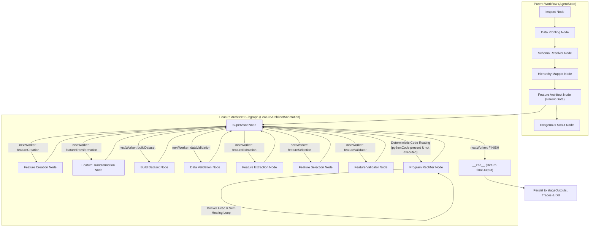
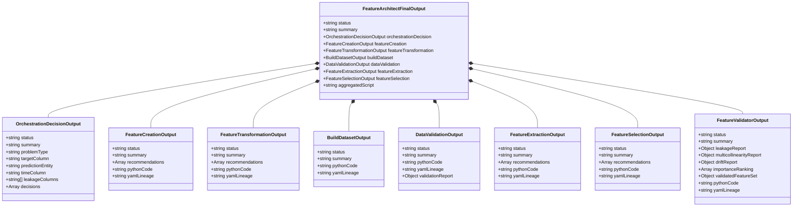
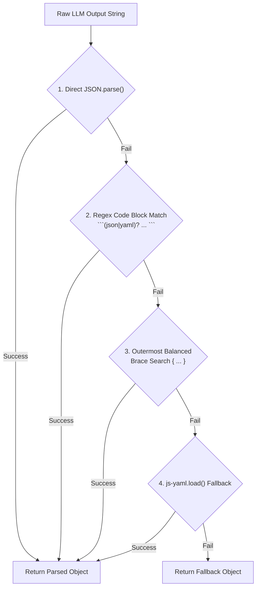
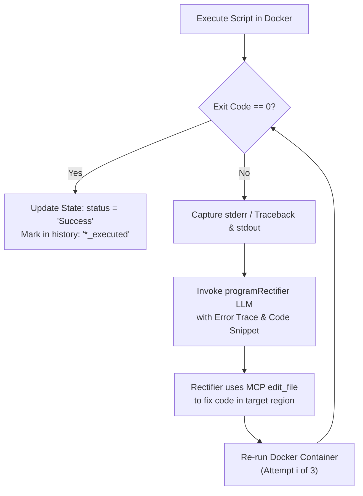

# Feature Architect: Comprehensive Architectural & Workflow Specification

This document provides an in-depth technical analysis and architectural reference for the **Feature Architect** engine within the AI Insights Platform backend. It details the design philosophy, LangGraph state graph architecture, input/output schemas, Model Context Protocol (MCP) filesystem integration, Docker execution sandbox, parsing and self-healing validation systems, memory management, and complete end-to-end execution lifecycle.

---

## 1. Executive Summary & High-Level Architecture

The **Feature Architect** is a hierarchical, multi-agent automated feature engineering and dataset generation engine built using **LangGraph**, **LangChain**, and **Docker**. It operates as the final intelligence layer in the ingestion-to-feature pipeline, transforming raw, profiled, and semantically resolved tabular schemas into production-ready machine learning feature matrices and a single, unified, executable Python pipeline script (`aggregated_feature_pipeline.py`).

### Key Architectural Pillars

1. **Hierarchical Supervisor-Worker Subgraph**: Encapsulated as a dedicated LangGraph subgraph (`createFeatureArchitectGraph()`) invoked inside the parent ingestion graph (`AgentState` $\rightarrow$ `featureArchitectNode`).
2. **Deterministic & Agentic Supervisor Routing**: The Supervisor node acts as a central decision engine, determining whether to route to domain worker nodes (Feature Creation, Transformation, Dataset Building, Validation, Extraction, Selection) or intercept state for code execution and error rectification.
3. **Single Aggregated Pipeline Script Strategy**: All worker agents interact with a single Python script (`aggregated_feature_pipeline.py`) divided into named comment regions (`# -- REGION: <NAME> START --`). Agents use Model Context Protocol (MCP) filesystem tools (`read_text_file`, `edit_file`, `write_file`) to perform surgical in-place code edits.
4. **Sandboxed Dockerized Code Execution**: Generated Python scripts are executed in real-time inside an isolated `python:3.12-slim` Docker container with strict CPU (2 cores) and memory (2 GB) limits, volume isolation, and AST-driven dependency parsing.
5. **Self-Healing Code Rectification**: If script execution fails in Docker, the `programRectificationNode` captures tracebacks and stderr, prompts an expert LLM debugger, applies fixes directly to the script via MCP tools, and re-executes up to 3 times.
6. **Multi-Tier Robust Parsing & Validation**: Agent responses undergo 4-tier fallback parsing (JSON $\rightarrow$ Markdown code block $\rightarrow$ Outermost braces regex $\rightarrow$ YAML) and are validated via an agentic LLM evaluator (`validateWithRetry`) with structural sanity checks.



---

## 2. Inputs and Outputs Specification

### 2.1 Inputs Entering the Feature Architect Subgraph

When `featureArchitectNode` is triggered from the parent graph, it maps relevant parent state from `AgentState.State` into the subgraph's `FeatureArchitectAnnotation.State`:

| Input Property | Type | Source | Description |
| :--- | :--- | :--- | :--- |
| `batchedTables` | `BatchedTableState[]` | Parent `AgentState.batchedTables` | List of candidate tables selected for processing, along with their batch statuses and summaries. |
| `inspector` | `Record<string, unknown>` | Parent `AgentState.inspection` | Complete schema metadata: table names, column data types, primary keys, foreign key constraints, and entity relations. |
| `dataProfile` | `Record<string, unknown>` | Parent `AgentState.dataProfile` | Data profiling output: null counts, uniqueness ratios, cardinality, value distributions, and statistical summaries per column. |
| `userPrompt` | `string` | Parent `AgentState.userPrompt` | Business objective, domain context, prediction goal, target metric requirements provided by the user. |
| `connectorId` | `string[]` | Parent `AgentState.connectorId` | Primary and secondary connector identifiers used to resolve data source connections (Postgres, MySQL, CSV, REST API). |
| `runTimestamp` | `string` | Parent `AgentState.runTimestamp` | Unique timestamp used to partition run directories (`uploads/projects/<projectId>/runs/<runTimestamp>/`). |
| `services` | `IngestionServices` | Configurable context (`config.configurable.services`) | Injected services including `connectorService`, `traceHelper`, `agentThinkingService`, `projectService`, and `duckDBService`. |

#### Example Input State Object:
```json
{
  "batchedTables": [
    { "tableName": "customers", "status": "Completed", "node": "resolveSchema", "summary": "Customer master record" },
    { "tableName": "orders", "status": "Completed", "node": "resolveSchema", "summary": "Transactional order records" }
  ],
  "userPrompt": "Predict customer 30-day churn probability based on historical orders and support tickets.",
  "connectorId": ["conn-uuid-1234"],
  "runTimestamp": "2026-08-23T14-30-00",
  "inspector": {
    "sources": [
      {
        "sourceName": "postgres_db",
        "tables": [
          {
            "tableName": "orders",
            "columns": [
              { "name": "order_id", "type": "INTEGER", "isPrimary": true },
              { "name": "customer_id", "type": "INTEGER", "isForeign": true },
              { "name": "order_date", "type": "TIMESTAMP" },
              { "name": "total_amount", "type": "DECIMAL(10,2)" }
            ]
          }
        ]
      }
    ]
  },
  "dataProfile": {
    "tables": [
      {
        "tableName": "orders",
        "completenessProfile": { "totalRows": 150000, "missingRows": 0 },
        "contentProfile": {
          "columns": [
            { "columnName": "total_amount", "nullPercentage": 0.01, "mean": 85.5, "std": 32.1 }
          ]
        }
      }
    ]
  }
}
```

---

### 2.2 Outputs Produced by Feature Architect

Each worker node generates structured JSON summaries, Python code fragments, and YAML lineage descriptions. The subgraph aggregates them into a consolidated result object before returning to the parent graph:



#### Final Output Stored in Parent Workflow State:
```json
{
  "featureArchitect": {
    "status": "completed",
    "summary": "Feature Architecture planning and execution completed successfully under supervisor control.",
    "orchestrationDecision": {
      "problemType": "classification",
      "targetColumn": "is_churn",
      "predictionEntity": "customer_id",
      "timeColumn": "order_date",
      "leakageColumns": ["cancellation_survey_score", "refund_status"],
      "decisions": [
        { "tableName": "customers", "confidence": "HIGH", "rationale": "Core entity demographics." },
        { "tableName": "orders", "confidence": "HIGH", "rationale": "RFM and transactional frequency features." }
      ]
    },
    "featureCreation": {
      "status": "Success",
      "summary": "Created RFM aggregations, 30-day rolling spend, and average order value.",
      "recommendations": [
        {
          "tableName": "orders",
          "newFeatures": [
            { "featureName": "avg_order_value_30d", "technique": "calculated", "sourceColumns": ["total_amount"], "description": "30-day spend divided by order count" }
          ]
        }
      ],
      "pythonCode": "def main_feature_creation(args_list=None): ...",
      "yamlLineage": "features:\n  - name: avg_order_value_30d\n    source: orders.total_amount"
    },
    "buildDataset": {
      "status": "Success",
      "summary": "Joined orders and customers tables at customer_id grain.",
      "pythonCode": "def main_build_dataset(args_list=None): ...",
      "yamlLineage": "dataset:\n  primary_key: customer_id\n  target: is_churn"
    },
    "dataValidation": {
      "status": "Success",
      "summary": "Audited dataset for nulls, constant columns, and target leakage.",
      "validationReport": {
        "nullRates": { "avg_order_value_30d": 0.0 },
        "anomalies": [],
        "leakageFound": false
      }
    }
  },
  "status": "completed",
  "summary": "Feature Engineering completed successfully",
  "steps": [
    { "name": "Feature Engineering", "status": "completed", "summary": "Architected feature creation, transformation, extraction, and selection." }
  ],
  "stageOutputs": { "featureArchitect": { "..." : "..." } },
  "stageStatuses": { "featureArchitect": "Completed" }
}
```

---

## 3. The Core Approach: Supervisor-Worker Subgraph & Region-Based Pipeline Architecture

The Feature Architect avoids monolithic prompt generation or disjoint multi-file code snippets. Instead, it adopts two core design patterns:

### 3.1 Hierarchical Supervisor-Worker State Machine

The workflow is constructed via `createFeatureArchitectGraph()` using LangGraph:
- **Supervisor Node (`supervisorNode.ts`)**: Serves as the brain. On every cycle, it reviews the execution history, schema details, user requirements, and previous worker outputs. It issues routing decisions via `nextWorker`.
- **Worker Nodes**: Specialized domain agents for specific phases of feature engineering.
- **Feedback Loop**: Every worker returns control directly back to `supervisorNode`.

```
[Start] --> [supervisorNode]
                  │
     ┌────────────┼────────────┬─────────────┬─────────────┬─────────────┐
     ▼            ▼            ▼             ▼             ▼             ▼
[Creation]  [Transform]    [BuildDS]     [Validate]    [Extract]     [Select]
     │            │            │             │             │             │
     └────────────┴────────────┼─────────────┴─────────────┴─────────────┘
                               ▼
                       [supervisorNode]
                               │ (Code detected)
                               ▼
                    [programRectificationNode]
                               │
                               ▼
                       [supervisorNode]
                               │ (All stages OK)
                               ▼
                            [Finish]
```

---

### 3.2 Single Aggregated Pipeline Script (`aggregated_feature_pipeline.py`)

Rather than maintaining disparate scripts (`creation.py`, `transformation.py`, etc.), the entire feature engineering pipeline is compiled into a single self-contained script (`aggregated_feature_pipeline.py`) stored in the sandbox run directory.

#### Canonical Region Template Structure:
```python
# Aggregated feature engineering script: aggregated_feature_pipeline.py

# Shared imports region
# -- REGION: SHARED_IMPORTS START --
# -- REGION: SHARED_IMPORTS END --

# Feature creation region
# -- REGION: FEATURE_CREATION START --
# -- REGION: FEATURE_CREATION END --

# Feature transformation region
# -- REGION: FEATURE_TRANSFORMATION START --
# -- REGION: FEATURE_TRANSFORMATION END --

# Build dataset region
# -- REGION: BUILD_DATASET START --
# -- REGION: BUILD_DATASET END --

# Data validation region
# -- REGION: DATA_VALIDATION START --
# -- REGION: DATA_VALIDATION END --

# Feature extraction region
# -- REGION: FEATURE_EXTRACTION START --
# -- REGION: FEATURE_EXTRACTION END --

# Feature selection region
# -- REGION: FEATURE_SELECTION START --
# -- REGION: FEATURE_SELECTION END --

# Pipeline Runner - Executes all stages sequentially
# -- PIPELINE_RUNNER START --
if __name__ == '__main__':
    import argparse
    import os
    import sys

    parser = argparse.ArgumentParser(description='Feature engineering pipeline runner')
    parser.add_argument('--db-path', type=str, required=True, help='Path to directory with CSV/data files')
    parser.add_argument('--split', type=str, default='train', choices=['train', 'val', 'test'])
    parser.add_argument('--out-dir', type=str, default=None, help='Directory to save/load transformers and outputs')
    parser.add_argument('--output-path', type=str, default=None, help='Output path for final dataset (Parquet)')
    parser.add_argument('--metadata-path', type=str, default=None, help='Path to save metadata YAML')
    parser.add_argument('--features-path', type=str, default=None, help='Path to features parquet/CSV')
    args, _ = parser.parse_known_args()
    
    db_path = args.db_path
    split = args.split
    out_dir = args.out_dir or db_path
    output_path = args.output_path or os.path.join(out_dir, 'dataset.parquet')
    metadata_path = args.metadata_path or os.path.join(out_dir, 'metadata.yaml')
    features_path = args.features_path or os.path.join(out_dir, 'order_features.parquet')

    if 'main_feature_creation' in dir():
        print('=== [1/6] Running Feature Creation ===')
        main_feature_creation(['--db-path', db_path])

    if 'main_feature_transformation' in dir():
        print('=== [2/6] Running Feature Transformation ===')
        main_feature_transformation(['--db-path', db_path, '--split', split, '--out-dir', out_dir])

    if 'main_build_dataset' in dir():
        print('=== [3/6] Running Build Dataset ===')
        main_build_dataset(['--db-path', db_path, '--output-path', output_path, '--metadata-path', metadata_path])

    if 'main_data_validation' in dir():
        print('=== [4/6] Running Data Validation ===')
        main_data_validation(['--db-path', db_path, '--output-path', os.path.join(out_dir, 'validation_report.json')])

    if 'main_feature_extraction' in dir():
        print('=== [5/6] Running Feature Extraction ===')
        main_feature_extraction(['--db-path', db_path])

    if 'main_feature_selection' in dir():
        print('=== [6/6] Running Feature Selection ===')
        main_feature_selection(['--db-path', db_path, '--features-path', output_path, '--output-path', os.path.join(out_dir, 'selected_features.parquet')])

    print('=== Pipeline Execution Complete ===')
# -- PIPELINE_RUNNER END --
```

---

### 3.3 Model Context Protocol (MCP) Filesystem Integration

Worker agents interact with the script on disk using the **Model Context Protocol** (`@modelcontextprotocol/server-filesystem`). 

1. `getMcpFilesystemClient()` spawns a stdio sub-process pointing to the MCP filesystem server with restricted directory access (the project sandbox run directory and `uploads/`).
2. Tools provided to the LLM:
   - `read_text_file(path)`: Allows the agent to read the existing script and locate the exact region markers.
   - `edit_file(path, edits)`: Performs surgical replacements inside `# -- REGION: <NAME> START --` and `# -- REGION: <NAME> END --`.
   - `write_file(path, content)`: Creates new files or writes boilerplate templates.

---

## 4. Step-by-Step Workflow and Lifecycle Breakdown

```mermaid
sequenceDiagram
    autonumber
    participant Parent as Parent Graph (featureArchitectNode)
    participant Sup as Supervisor Node
    participant FC as Feature Creation Worker
    participant Rect as Program Rectifier Node
    participant Docker as Docker Python Container
    participant Valid as Validator (validateWithRetry)

    Parent->>Sup: Invoke Subgraph with tables, inspection, profile, prompt
    Sup->>Sup: Evaluate problem formulation (problemType, targetColumn, entities)
    Sup->>FC: Dispatch "featureCreation"
    FC->>FC: Call MCP read_text_file to find FEATURE_CREATION region
    FC->>FC: Call MCP edit_file to insert main_feature_creation()
    FC->>Valid: Return JSON output (recommendations, pythonCode, yamlLineage)
    Valid->>FC: Validate structural and LLM criteria
    FC->>Sup: Return state update (featureCreation.pythonCode present)
    
    Note over Sup: Deterministic Interception:<br/>featureCreation_executed NOT in history
    Sup->>Rect: Route to "programRectifier"
    Rect->>Docker: Execute aggregated_feature_pipeline.py
    alt Execution Successful (exitCode 0)
        Docker-->>Rect: stdout, stderr
        Rect->>Sup: Mark "featureCreation_executed" in history
    else Execution Failed (exitCode != 0)
        Docker-->>Rect: Traceback / Exception stderr
        Rect->>Rect: Ask Program Rectifier LLM to fix code via MCP edit_file
        Rect->>Docker: Re-execute in Docker (up to 3 attempts)
        Rect->>Sup: Update script and append execution history
    end

    Note over Sup: Supervisor proceeds sequentially:<br/>Transformation -> BuildDataset -> Validation -> Extraction -> Selection
    Sup->>Parent: safeNextWorker == "FINISH" -> Return finalOutput
```

### Detailed Execution Steps:

#### Step 1: Subgraph Initialization & Problem Formulation
- **Node**: `supervisorNode`
- **Prompt**: `featureSupervisor.md`
- **Actions**: Reads candidate tables and inspection profiles via tools (`getTableNames`, `getTableColumnsAndProfile`). Formulates `problemType` (classification/regression/forecasting), `targetColumn`, `predictionEntity`, `timeColumn`, and `leakageColumns`.
- **Decision**: Outputs `nextWorker: "featureCreation"`.

#### Step 2: Feature Creation
- **Node**: `featureCreationNode`
- **Prompt**: `featureCreation.md`
- **Actions**: Proposes domain-specific feature engineering (One-Hot Encoding, numerical binning, datetime field splitting, rolling aggregations, cross-table ratio interactions).
- **Filesystem Action**: Uses MCP `read_text_file` to locate `FEATURE_CREATION` region in `aggregated_feature_pipeline.py` and `edit_file` to write `main_feature_creation(args_list=None)`.
- **Output**: JSON containing recommendations array, `pythonCode`, and `yamlLineage`.

#### Step 3: Deterministic Code Execution & Rectification of Feature Creation
- **Interception**: `supervisorNode` detects that `state.featureCreation?.pythonCode` exists and `history` does not contain `"featureCreation_executed"`.
- **Routing**: Bypasses LLM prompt and immediately sets `nextWorker: "programRectifier"`.
- **Node**: `programRectificationNode`.
- **Execution**: Runs the aggregated script inside the Docker container against the project's data files.
- **Handling**: If exit code is 0, logs success and returns to Supervisor. If non-zero, triggers the Rectifier LLM (`programRectifier.md`) to read traceback, edit the script, and re-run.

#### Step 4: Feature Transformation & Imputation
- **Node**: `featureTransformationNode`
- **Prompt**: `featureTransformation.md`
- **Actions**: Recommends missing value imputation (median/mode/KNN), scaling (`StandardScaler`, `RobustScaler`), power transforms (`log1p`, Box-Cox), and rare category pooling.
- **Enforcement**: Must fit transformers only on training splits to prevent data leakage.
- **Filesystem Action**: Edits the `FEATURE_TRANSFORMATION` region in `aggregated_feature_pipeline.py`.

#### Step 5: Dataset Assembly (Build Dataset)
- **Node**: `buildDatasetNode`
- **Prompt**: `buildDataset.md`
- **Actions**: Formulates the multi-table join plan at the prediction entity grain (`predictionEntity`).
- **Filesystem Action**: Edits `BUILD_DATASET` region with `main_build_dataset(args_list=None)`, generating a unified Parquet file at `--output-path` (`dataset.parquet`).

#### Step 6: Data Quality & Target Leakage Validation
- **Node**: `dataValidationNode`
- **Prompt**: `dataValidation.md`
- **Actions**: Audits the assembled dataset matrix for null rates, constant columns, duplicate entity keys, and correlation with the target variable to flag target leakage.
- **Filesystem Action**: Edits `DATA_VALIDATION` region to output `validation_report.json`.

#### Step 7: Feature Extraction & Dimensionality Reduction
- **Node**: `featureExtractionNode`
- **Prompt**: `featureExtraction.md`
- **Actions**: Evaluates whether high-dimensional sparse features require dimensionality reduction (PCA, TruncatedSVD, UMAP). If required, generates code in `FEATURE_EXTRACTION` region and persists component variance metadata.

#### Step 8: Feature Selection & Pruning
- **Node**: `featureSelectionNode`
- **Prompt**: `featureSelection.md`
- **Actions**: Applies collinearity filters ($>0.95$ Pearson correlation), low-variance thresholds ($Var < 0.01$), and tree-based importance metrics (RandomForest/LightGBM importance).
- **Filesystem Action**: Edits `FEATURE_SELECTION` region to export the final dataset to `selected_features.parquet`.

#### Step 9: Supervisor Finalization (`FINISH`)
- **Node**: `supervisorNode`
- **Action**: Verifies that all mandatory stages (`featureCreation`, `featureTransformation`, `buildDataset`, `dataValidation`, `featureSelection`) have completed with `status: "OK"`.
- **Output**: Returns `nextWorker: "FINISH"` and compiles `finalOutput`. Control returns to `featureArchitectNode.ts`, which packages the result for the main platform.

---

## 5. Parsing, Error Handling, and Self-Healing Validation

### 5.1 4-Tier Robust JSON Parsing (`parseJsonObject`)

Because LLMs can produce varied formats (raw JSON, markdown code blocks, explanatory preamble, or YAML), the system uses a 4-tier extractor in `agentUtils.ts`:



1. **Direct Parse**: `JSON.parse(trimmed)`.
2. **Code Block Regex**: Matches ```` ```(?:json|yaml|yml)?\s*([\s\S]*?)\s*``` ```` and parses inner content via JSON and YAML.
3. **Balanced Brace Extraction**: Finds the first `{` and last `}` in the string and parses the slice.
4. **YAML Fallback**: `yaml.load(trimmed)` to handle structured YAML dictionaries.
5. **Tool Output Fallback**: If all text parsers fail, `getLastToolResult()` inspects the LangChain tool call stream messages to extract the last structured output returned by an executed tool.

---

### 5.2 Agentic & Structural Quality Gates (`validateWithRetry`)

All worker nodes wrap their agent invocation in `validateWithRetry()` located in `src/agents/validator/validatorNode.ts`:

```typescript
export async function validateWithRetry<T extends Record<string, unknown>>(
  stepName: string,
  invokeFn: () => Promise<T>,
  fallback: T,
  services?: IngestionServices,
  maxRetries = 3
): Promise<T>
```

#### Two-Stage Validation Loop:
1. **Agentic LLM-as-a-Judge**: Evaluates whether the generated JSON matches the required domain context and expected schemas. The evaluator prompt returns `{ "shouldRetry": boolean, "reason": string }`.
2. **Structural Heuristics (`looksLikeError`)**:
   - Inspects mandatory output keys per node:
     - `featureCreation`: `["status", "summary", "recommendations", "pythonCode", "yamlLineage"]`
     - `buildDataset`: `["status", "summary", "pythonCode", "yamlLineage"]`
     - `programRectifier`: `["status", "rectifiedCode", "explanation"]`
   - Validates that arrays and strings are non-empty and non-null.
   - Enforces retry if output status is `"in-progress"` without artifact completion.
   - Automatically repeats the agent execution loop up to 3 times before falling back.

---

### 5.3 Program Rectification Self-Healing Loop

When Docker execution fails, the `programRectificationNode` performs automated code repair:



---

## 6. Execution Environment & Sandboxed Docker Engine

Python execution is handled by `pythonExecutor.ts` via `dockerode`:

### 6.1 Container Specifications & Resource Isolation

| Feature | Specification |
| :--- | :--- |
| **Docker Base Image** | `python:3.12-slim` |
| **Memory Limit** | `2 GB` (`2 * 1024 * 1024 * 1024` bytes) |
| **CPU Limit** | `2 CPUs` (`NanoCpus: 2 * 1000000000`) |
| **Container Lifecycle** | Persistent long-running daemon (`sleep infinity`), stopped on completion but retained per project for fast exec reuse (`ai-insights-feature-arch-executor-<projectId>`). |
| **Volume Binds** | - Sandbox Run Dir $\rightarrow$ `/workspace`<br>- DuckDB Dir $\rightarrow$ `/workspace/duckdb`<br>- Uploads Dir $\rightarrow$ `/workspace/uploads` |

---

### 6.2 AST Dependency Resolution & Pip Installation

Before executing the script, `parseRequiredPackages(code)` uses regular expressions to parse all `import` and `from ... import` statements against a curated allowlist:

```typescript
const ALLOWLIST = new Set([
  "numpy", "pandas", "scipy", "scikit-learn", "matplotlib", "seaborn",
  "opencv-python", "pillow", "torch", "torchvision", "transformers",
  "datasets", "xgboost", "lightgbm", "duckdb", "pyyaml", "scikit-image"
]);
```

If dependencies (e.g. `scikit-learn`, `xgboost`, `pyyaml`) are required, the execution command prepends dynamic non-cached installation:
```bash
pip install --no-cache-dir --disable-pip-version-check --root-user-action=ignore scikit-learn pyyaml xgboost && python "aggregated_feature_pipeline.py" --db-path "/workspace/uploads"
```

---

### 6.3 Docker Multiplexed Stream Demuxing

Docker daemon stdout/stderr streams are multiplexed with an 8-byte binary header:
- `Byte 0`: Stream type (`1` = stdout, `2` = stderr).
- `Bytes 1–3`: Padding (`0x00`).
- `Bytes 4–7`: Big-endian 32-bit integer frame length.

`demuxDockerLogs(buffer)` in `pythonExecutor.ts` demultiplexes these binary chunks to cleanly isolate `stdout` (for logging and data frames) and `stderr` (for exceptions and stack traces).

---

## 7. Context Management, State Persistence, and Memory

### 7.1 Memory and Session Continuity
- **LangGraph Checkpointing**: Session persistence is maintained via `MemorySaver` using `threadId`. This enables pause-and-resume workflows, allowing human review after data ingestion before proceeding into feature engineering.
- **Workflow State Reducers**: Annotations in `FeatureArchitectAnnotation` define explicit reducer functions (e.g. merging history arrays, retaining the latest outputs, preserving script locks).

### 7.2 Context Window Optimization & Scoping
To prevent overflowing the LLM context window with multi-gigabyte tabular datasets:
1. **Tool-Driven Metadata Discovery**: Raw rows are never dumped directly into prompts. Agents query column types and profile statistics on-demand via `getTableColumnsAndProfile(tableName)`.
2. **Secret Redaction**: `AgentTraceHelper` automatically scrubs passwords, API keys, bearer tokens, and credentials from inputs, outputs, and trace files.

---

### 7.3 Data Storage & Persistence Map

| Storage Layer | Location / Target | Description |
| :--- | :--- | :--- |
| **Sandbox Filesystem** | `uploads/projects/<projectId>/runs/<runTimestamp>/` | Contains `aggregated_feature_pipeline.py`, intermediate feature tables (`order_features.parquet`), built dataset (`dataset.parquet`), validation reports (`validation_report.json`), and final selected features (`selected_features.parquet`). |
| **PostgreSQL Database** | Tables: `agent_jobs`, `agent_thinking`, `connectors` | Persists job statuses, connector credentials, and streaming agent thoughts/milestones. |
| **Live Thinking Stream** | `agent_thinking` table $\rightarrow$ Frontend Polling / SSE | `logMilestoneThinking()` records real-time agent thinking events so UI progress bars update live. |
| **Diagnostic Traces** | `logs/ai-traces/<stamp>.log` | Comprehensive, sanitized audit log of every LLM interaction, token payload, tool call, and error. |

---

## 8. Summary File Map

| File Path | Role & Responsibilities |
| :--- | :--- |
| `src/agents/FeatureEngineering/FeatureArchitect/state.ts` | Defines `FeatureArchitectAnnotation` state schema, interfaces, and reducer functions. |
| `src/agents/FeatureEngineering/FeatureArchitect/graph.ts` | Compiles the LangGraph StateGraph, registers nodes, and configures supervisor conditional routing. |
| `src/agents/FeatureEngineering/FeatureArchitect/featureArchitectNode.ts` | Parent-to-subgraph wrapper. Bridges `AgentState` with `FeatureArchitectAnnotation`. |
| `src/agents/FeatureEngineering/FeatureArchitect/supervisorNode.ts` | Central orchestration engine. Manages problem definition, worker dispatching, and code execution routing. |
| `src/agents/FeatureEngineering/FeatureArchitect/featureCreationNode.ts` | Feature creation worker. Generates mathematical, encoding, and aggregation features. |
| `src/agents/FeatureEngineering/FeatureArchitect/featureTransformationNode.ts` | Feature transformation worker. Implements scalers, power transforms, and imputations. |
| `src/agents/FeatureEngineering/FeatureArchitect/buildDatasetNode.ts` | Dataset assembly worker. Plans entity-grain joins and builds the baseline matrix. |
| `src/agents/FeatureEngineering/FeatureArchitect/dataValidationNode.ts` | Data validation worker. Audits null ratios, duplicates, and target leakage. |
| `src/agents/FeatureEngineering/FeatureArchitect/featureExtractionNode.ts` | Feature extraction worker. Evaluates PCA / dimensionality reduction. |
| `src/agents/FeatureEngineering/FeatureArchitect/featureSelectionNode.ts` | Feature selection worker. Applies correlation and tree importance filters. |
| `src/agents/FeatureEngineering/FeatureArchitect/programRectificationNode.ts` | Sandboxed script executor and automated debugger. Fixes code errors in Docker. |
| `src/agents/tools/featureArchitect/featureArchitect.tools.ts` | Tools for table inspection (`getTableNames`, `getTableColumnsAndProfile`, `makePipelineTemplate`). |
| `src/agents/tools/filesystem/mcpFilesystemClient.ts` | MCP server-filesystem client providing `read_text_file`, `edit_file`, and `write_file`. |
| `src/agents/tools/helpers/pythonExecutor.ts` | Dockerode container manager, dependency analyzer, stream demuxer, and executor. |
| `src/agents/validator/validatorNode.ts` | Validation gatekeeper with LLM evaluator and structural checks (`validateWithRetry`). |
| `src/agents/utils/agentUtils.ts` | LLM invocation (`invokeAgentJson`), 4-tier JSON parsing (`parseJsonObject`), and tracing. |
